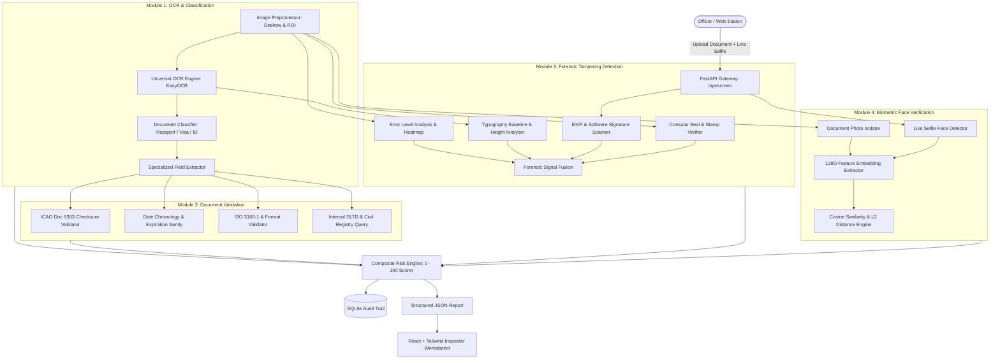

# AI-Based Fake Identity & Document Screening System — System Architecture

## 1. Executive Summary & Problem Context
Border security checkpoints and immigration stations process thousands of travel documents (passports, visas, national IDs, and residence permits) every day. Manual inspection by human officers is time-consuming, subjective, and prone to missing sophisticated digital forgeries such as:
- **Biometric Photo Splicing**: Replacing the original holder portrait with an impostor's photograph.
- **Printed Text Overlays**: Digitally altering expiration dates, birth dates, or visa stay limits with non-matching fonts.
- **Counterfeit Seals & Stamps**: Simulating official consular circular rubber stamps with desktop graphics.
- **Stolen / Revoked Credentials**: Using genuine documents that have been reported lost, stolen, or flagged on Interpol databases.

**SENTINEL-ID** is an automated screening assistant designed to assist (not replace) human reviewers by executing a multi-tiered, multi-signal inspection pipeline in seconds, outputting an explainable **Composite Risk Score (0–100)** with color-coded risk tiers (🟢 Green, 🟡 Amber, 🔴 Red) and specific forensic triggers.

---

## 2. End-to-End Pipeline Architecture

---

## 3. Detailed Component Breakdown

### Module 1 — OCR Extraction & Document Classification
- **Preprocessing Pipeline** (`backend/app/modules/ocr/preprocessor.py`):
  - Ingestion of JPEG, PNG, and multi-page PDF documents.
  - Automatic orientation correction and deskewing via Hough line transforms.
  - Contrast Limited Adaptive Histogram Equalization (CLAHE) + bilateral filtering to preserve sharp character edges while suppressing background security guilloche noise.
  - Region of Interest (ROI) slicing for the Machine Readable Zone (MRZ), Visual Inspection Zone (VIZ), and portrait photo quadrant.
- **Universal OCR Engine** (`backend/app/modules/ocr/engine.py`):
  - Primary deep OCR optical recognition via EasyOCR with cached singletons.
  - Monospace character cleaner and fallback morphological line segmentation.
- **Document Classifier & Router** (`backend/app/modules/ocr/classifier.py`):
  - Analyzes MRZ leading signatures (`P<` $\rightarrow$ Passport, `V<` $\rightarrow$ Visa, `I<` $\rightarrow$ National ID) and header keywords.
- **Specialized Field Extractors**:
  - `passport_extractor.py`: Parses surname, given names, passport number, nationality, date of birth, date of expiry, gender, and check digits. Reconciles MRZ and Visual Inspection Zone text.
  - `visa_extractor.py`: Extracts visa number, visa category, entry validation (Single/Multiple/M), stay duration, validity dates, and issuing post.
  - `id_extractor.py`: Extracts identification number, full name, DOB, issue date, and license category.

---

### Module 2 — Document Validation & Watchlists
- **ICAO Doc 9303 Checksum Validator** (`backend/app/modules/validation/mrz_validator.py`):
  - Implements the official ICAO 7-3-1 weight pattern modulo 10 algorithm:
    $$\text{CheckDigit} = \left( \sum_{i=0}^{n-1} \text{value}(c_i) \times w_{i \pmod 3} \right) \pmod{10}$$
    where $w \in \{7, 3, 1\}$ and values for $[0-9] \to 0-9$, $[A-Z] \to 10-35$, and `"<"` $\to 0$.
  - Validates document number, date of birth, expiration date, and overall composite check digits.
- **Date Chronology Sanity** (`backend/app/modules/validation/date_validator.py`):
  - Enforces: $\text{Expiry Date} > \text{Issue Date} > \text{Date of Birth}$.
  - Detects expired documents and alerts for credentials expiring within 6 months.
  - Enforces adult validity limits ($\le 10$ years) and infant/child age bounds.
- **ISO 3166-1 Country Code & Format Checks** (`backend/app/modules/validation/code_validator.py`):
  - Validates 3-letter issuing country and nationality codes against ISO 3166-1 alpha-3 standards.
  - Cross-checks VIZ text vs. MRZ text (catches tampered visual dates that conflict with the MRZ).
- **Watchlist & Registry Lookup** (`backend/app/modules/validation/watchlist.py`):
  - Queries local editable mock databases (`mock_watchlist.json` and `mock_issued_registry.json`).
  - Flags Interpol Stolen and Lost Travel Documents (SLTD) hits, Red Notices, and travel restrictions.

---

### Module 3 — Forensic Tampering Detection (Core AI Suite)
1. **Error Level Analysis (ELA)** (`backend/app/modules/forensics/ela.py`):
   - Resaves image at controlled 90% JPEG quality to measure quantization differentials.
   - Computes absolute difference: $\Delta = |I_{\text{original}} - I_{\text{resaved}}|$.
   - Analyzes regional discrepancy ratios and photo quadrant variance to detect spliced elements.
   - Generates a visual ColorJet **ELA Heatmap** rendered directly on the inspector UI.
2. **Typography & Font Consistency Analyzer** (`backend/app/modules/forensics/font_analyzer.py`):
   - Groups text into horizontal alignment tiers.
   - Computes baseline vertical deviations and character height ratios to flag digital text overlays and altered numbers.
3. **Metadata & Header Forensics** (`backend/app/modules/forensics/metadata_analyzer.py`):
   - Parses EXIF, XMP, and JFIF data using `exifread` and PIL.
   - Flags digital editing fingerprints (Photoshop, GIMP, Canva, PicsArt).
4. **Official Circular Stamp & Seal Verifier** (`backend/app/modules/forensics/stamp_verifier.py`):
   - Locates circular ink impressions using Hough Circle Transforms.
   - Compares candidate regions against consular reference templates (`data/reference_stamps/consular_seal_reference.png`) using 2D normalized cross-correlation, HSV color histogram correlation, and Canny edge density.

---

### Module 4 — Biometric Face Verification
- **Face Detection & Alignment** (`backend/app/modules/face/detector.py`):
  - Dual-mode face detector: Haar cascade classifier coupled with skin-tone HSV morphological oval segmentation.
  - Automatically isolates the document photo quadrant and live camera selfie, normalizing crops to $160 \times 160$ px.
- **128D Embedding Representation** (`backend/app/modules/face/embedder.py`):
  - Generates normalized 128-dimensional biometric feature vectors combining multi-zone spatial gradient descriptors (Sobel magnitude and 4-bin angular orientations) with color/texture moments.
- **Biometric Matching & Thresholding** (`backend/app/modules/face/matcher.py`):
  - Calculates Cosine Similarity:
    $$\text{Sim} = \frac{\mathbf{u} \cdot \mathbf{v}}{\|\mathbf{u}\|_2 \|\mathbf{v}\|_2}$$
  - Calculates Euclidean Distance: $L_2 = \|\mathbf{u} - \mathbf{v}\|_2$.
  - Enforces a 65% match threshold for confirmed identity vs. impostor mismatch alerts.

---

## 4. Composite Risk Scoring Model

The overall risk score $R \in [0, 100]$ synthesizes all 4 modules:

$$R = w_{\text{tamper}} \cdot S_{\text{tamper}} + w_{\text{face}} \cdot S_{\text{face\_mismatch}} + w_{\text{val}} \cdot S_{\text{val\_flags}} + w_{\text{ocr}} \cdot S_{\text{ocr\_unread}}$$

### Standard Weights:
| Factor | Weight | Source |
|---|---|---|
| **Forensics ($S_{\text{tamper}}$)** | **40%** | ELA recompression, font consistency, EXIF software tags, seal match |
| **Biometrics ($S_{\text{face}}$)** | **30%** | 1:1 facial embedding cosine mismatch |
| **Validation ($S_{\text{val}}$)** | **20%** | ICAO MRZ checksums, date chronology, ISO country validity |
| **OCR ($S_{\text{ocr}}$)** | **10%** | Readability confidence and unparsed fields |

### Critical Overrides:
- **Interpol SLTD / Watchlist Hit**: $R \leftarrow 100.0$ (Immediate Critical Red Alert).
- **Editing Software (Photoshop / GIMP)**: $R \leftarrow \max(R, 85.0)$ (Immediate High Risk Red).
- **Photo Splicing (ELA Anomaly)**: $R \leftarrow \max(R, 78.0)$ (Immediate High Risk Red).
- **Biometric Mismatch (Impersonation)**: $R \leftarrow \max(R, 75.0)$ (Immediate High Risk Red).

### Risk Tiers & Actions:
- **0 – 29 (LOW RISK 🟢)**: Document authentic, checksums valid, biometric match confirmed. Ready for auto-approval.
- **30 – 69 (MEDIUM RISK 🟡)**: Minor discrepancies (near expiration, baseline tilt). Refer to secondary tactile inspection.
- **70 – 100 (HIGH RISK 🔴)**: Forgery, photo splicing, or Interpol alert. Reject and impound.

---

## 5. Persistence & Data Governance
- **SQLite Database** (`backend/app/data/screenings.db`):
  - Stores timestamped screening records, overall risk score, risk tier, sub-scores, officer decisions (APPROVED, REJECTED, ESCALATED), and inspector notes.
- **Zero Real PII Compliance**:
  - The system bundles a standalone programmatic generator (`scripts/generate_specimens.py`) creating 100% synthetic specimen documents and simulated portraits. No real individual data is used.
