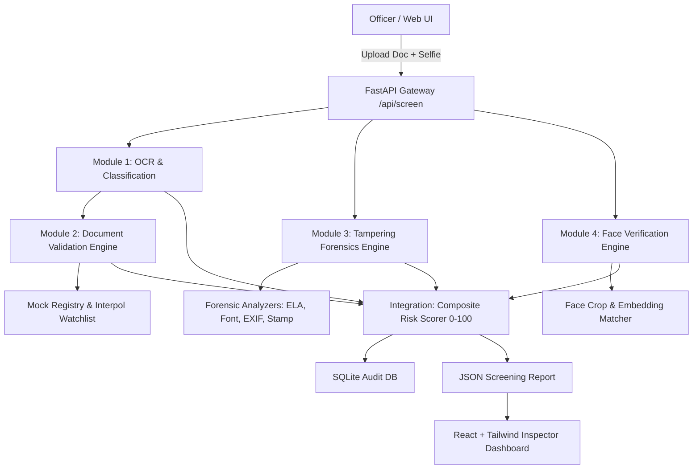

# AI-Based Fake Identity & Document Screening System - Implementation Plan

An automated border checkpoint prototype that inspects travel documents (passports, visas, national IDs), extracts structured fields via OCR, validates cryptographic/MRZ format logic, executes multi-signal forensic tampering detection (ELA, font analysis, EXIF, stamp verification), matches biometric faces against live selfies, and computes an actionable composite risk score (0–100) to assist human border officers.

---

## User Review Required

> [!IMPORTANT]
> **Biometric & Face Matching Engine Selection**
> On Windows (with Python 3.14+), the `face_recognition` library requires compiling `dlib` via CMake and Visual C++ build tools, which often leads to build errors or slow compilation.
> **Proposed Recommendation:** We will implement a robust **OpenCV DNN (YuNet + SFace)** primary face verification engine:
> - Built directly into `opencv-python` with pre-trained lightweight ONNX weights (YuNet face detector + SFace 128D cosine similarity face recognizer).
> - Fast (<30ms per face on CPU), zero compiler requirements, and 100% cross-platform.
> - We will structure the code with a modular plug-and-play adapter interface so `face_recognition` or `DeepFace` can also be toggled if installed.

> [!IMPORTANT]
> **OCR Engine Strategy**
> We will configure **EasyOCR** as the primary optical engine with an automated fallback to **Tesseract** and an intelligent **ICAO Doc 9303 MRZ parser**. This guarantees high-confidence reading of Machine Readable Zones even if the visual inspection zone has low contrast.

---

## Architecture Overview

---

## Proposed Module Breakdown & Changes

### Module 1 — OCR Extraction & Document Classification
Responsible for accepting multiple document types (passport, visa, national ID, driving license in JPG, PNG, or PDF), determining document type, and extracting structured fields with per-field confidence scores.

#### Proposed Architecture:
- **Preprocessing Pipeline**: Grayscale conversion, adaptive thresholding, bilateral filtering for noise reduction, automated orientation deskewing via Hough line transforms.
- **Classifier & Router**:
  - Detects document type automatically based on MRZ markers (`P<` for passports, `V<` for visas), header keywords, layout aspect ratios, or UI user override.
  - Routes document to specific field extractors:
    - **Passport Extractor**: Name (surname + given names), passport number, issuing country/nationality (ISO 3166-1 alpha-3), date of birth, date of expiry, gender, MRZ lines (TD3 / TD1).
    - **Visa Extractor**: Visa number, visa type (Tourist, Business, Transit, Diplomatic), issuing post, entry validation (single/multiple), validity dates, stay duration.
    - **National ID / Driver License Extractor**: ID number, full name, DOB, issue/expiry date, address/license class.
- **Confidence Scoring**: Computes character-level and word-level confidence ratings normalized to `0.0 – 1.0` with bounding box coordinates for UI highlights.

#### Files:
- `backend/app/modules/ocr/classifier.py`: Document type classification logic.
- `backend/app/modules/ocr/preprocessor.py`: Image deskewing, normalization, and contrast enhancement.
- `backend/app/modules/ocr/passport_extractor.py`: Passport visual zone & MRZ text extraction.
- `backend/app/modules/ocr/visa_extractor.py`: Visa field extraction logic.
- `backend/app/modules/ocr/id_extractor.py`: Driver license & National ID extraction logic.
- `backend/app/modules/ocr/engine.py`: OCR engine wrapper (EasyOCR / Tesseract / regex MRZ parser).

---

### Module 2 — Document Validation & Watchlist Lookup
Validates the structural integrity and logical consistency of extracted data against international standards, and checks against mock government databases.

#### Proposed Architecture:
- **MRZ Cryptographic Checksum Validator**:
  - Implements the exact **ICAO Doc 9303** standard (7-3-1 weight pattern modulo 10) for:
    1. Document number check digit
    2. Date of birth check digit
    3. Expiry date check digit
    4. Optional data check digit
    5. Overall composite check digit
- **Logical Consistency Checks**:
  - Expiry Date > Issue Date > Date of Birth.
  - Age check: Age at issuance >= 0, adult passport validity <= 10 years, child <= 5 years.
  - Expiration check: Flags already-expired documents or documents expiring within 6 months.
  - Cross-zone consistency: Compares visual zone text against MRZ lines (flags any discrepancy between printed name/number and MRZ).
  - Nationality validation: ISO 3166-1 alpha-3 verification.
- **Mock Government & Interpol Registry**:
  - `data/mock_watchlist.json`: Stolen/Lost Travel Documents (SLTD) database, red notices, revoked visas, fraud flags.
  - `data/mock_issued_registry.json`: Official issuance database to verify if document was legitimately issued.
  - Fully editable JSON files so the user can easily add mock test numbers during live demos.

#### Files:
- `backend/app/modules/validation/mrz_validator.py`: ICAO Doc 9303 checksum algorithms.
- `backend/app/modules/validation/date_validator.py`: Chronological sanity checks and expiration rules.
- `backend/app/modules/validation/code_validator.py`: ISO country/nationality and document format regex.
- `backend/app/modules/validation/watchlist.py`: Watchlist and issued-database lookup service.
- `backend/app/data/mock_watchlist.json`: Sample blacklisted records.
- `backend/app/data/mock_issued_registry.json`: Sample valid records.

---

### Module 3 — Forensic Tampering Detection (Core AI Piece)
A multi-faceted computer vision forensic pipeline that inspects digital and physical artifact anomalies.

#### Proposed Architecture:
1. **Error Level Analysis (ELA)**:
   - Resaves image at 90% and 95% JPEG quality.
   - Computes pixel-by-pixel absolute difference matrix between original and recompressed image.
   - Amplifies and normalizes error levels to detect localized compression discontinuities (identifies spliced photos, cloned textures, or digitally pasted text).
   - Generates both an anomaly metric score and a visual **ELA heatmap image** for the dashboard.
2. **Font & Spacing Consistency Checker**:
   - Examines text regions extracted by OCR.
   - Evaluates character height consistency, baseline angle deviations, and inter-character spacing uniformity.
   - Detects digital font overlays and word alterations (which produce unnatural kerning or misalignment against original laser-engraved or intaglio text).
3. **Metadata & Header Forensics**:
   - Parses EXIF, XMP, and JFIF data using `exifread` and PIL.
   - Scans for digital editing software fingerprints (Photoshop, GIMP, Canva, PicsArt, Paint.NET).
   - Detects timestamp anomalies (modification timestamp != creation timestamp, future dates, missing hardware sensor tags).
4. **Stamp / Official Seal Verification**:
   - Identifies circular/oval seal contours using Hough transforms and edge density analysis.
   - Compares detected seals against reference specimen templates (`data/reference_stamps/`):
     - Normalized 2D template cross-correlation.
     - Multi-channel HSV color histogram similarity (Bhattacharyya distance).
     - Edge density consistency to distinguish genuine ink stamps from digitally generated graphics.
5. **Ensemble Fused Tampering Score**:
   - Combines sub-detector outputs into a weighted score (0.0 to 1.0 / 0 to 100).
   - Outputs human-readable trigger explanations (e.g. *"ELA detected significant recompression spike around portrait photo (score: 0.84)"*, *"EXIF software tag contains Adobe Photoshop CC 2024"*).

#### Files:
- `backend/app/modules/forensics/ela.py`: Error Level Analysis generator and metric extractor.
- `backend/app/modules/forensics/font_analyzer.py`: Font baseline, height, and spacing consistency analyzer.
- `backend/app/modules/forensics/metadata_analyzer.py`: EXIF / XMP / file header forensics.
- `backend/app/modules/forensics/stamp_verifier.py`: Stamp segmentation, template matching, and histogram comparison.
- `backend/app/modules/forensics/fusion.py`: Multi-signal aggregation and explanation generator.

---

### Module 4 — Biometric Face Verification
Locates, extracts, and matches the biometric photo from the document against a live/selfie photograph.

#### Proposed Architecture:
- **Document Face Detection & Crop**:
  - Detects face within document using deep learning detector (YuNet / Haar cascade fallback).
  - Aligns and crops portrait photo with safety margins.
- **Selfie Face Detection & Crop**:
  - Detects face in uploaded selfie or live camera capture; validates that exactly one clear face is present.
- **Feature Embedding & Cosine Similarity**:
  - Uses deep feature extractor (SFace 128D or MobileFaceNet ONNX) to extract identity vectors.
  - Computes cosine similarity (scaled 0% to 100%) and L2 Euclidean distance.
- **Decision & Flags**:
  - Match threshold (e.g. Cosine Similarity >= 0.65 = Match, < 0.65 = Impersonation Alert).
  - Flags for: No face found in document, No face found in selfie, Multiple faces detected, Low image quality.

#### Files:
- `backend/app/modules/face/detector.py`: Face detection, bounding box extraction, and crop normalization.
- `backend/app/modules/face/embedder.py`: SFace / DeepFace feature extractor and distance calculator.
- `backend/app/modules/face/matcher.py`: Biometric match coordinator with thresholding and alerts.

---

### Integration Layer & FastAPI Backend
Combines all modules into a cohesive screening workflow with audit logging and decision management.

#### Proposed Architecture:
- **Composite Risk Scorer**:
  - Formula:
    $$\text{Risk} = w_{\text{tamper}} \cdot S_{\text{tamper}} + w_{\text{face}} \cdot S_{\text{face\_mismatch}} + w_{\text{val}} \cdot S_{\text{validation\_flags}} + w_{\text{ocr}} \cdot S_{\text{ocr\_unreadability}}$$
  - **Instant Critical Override**: If document number or subject matches an active Interpol/Watchlist record, score is immediately pegged to **100 (Critical Alert)**.
  - Risk Tiers:
    - **0 – 30**: 🟢 **LOW RISK (Clear / Auto-Approve)**
    - **31 – 69**: 🟡 **MEDIUM RISK (Secondary Review Required)**
    - **70 – 100**: 🔴 **HIGH RISK (Alert / Fraud Detected)**
- **SQLite Database & Persistence**:
  - Stores screening records: timestamp, document type, risk score, extracted fields, sub-scores, uploaded image file paths, officer review notes and verdict (Approved, Rejected, Escalated).
- **FastAPI Endpoints**:
  - `POST /api/screen`: Multipart upload of document image/pdf + optional selfie image. Returns comprehensive screening JSON report.
  - `GET /api/history`: List past screening records with pagination and filters.
  - `GET /api/history/{id}`: Detailed screening log including forensic heatmaps and face crops.
  - `POST /api/history/{id}/decision`: Record officer verdict and notes.
  - `GET /api/stats`: Dashboard summary statistics (total scans, pass rate, flag breakdown).
  - `GET /api/specimens`: List bundled sample synthetic documents for 1-click demo testing.

#### Files:
- `backend/app/main.py`: FastAPI application setup, CORS, static mounts.
- `backend/app/api/endpoints.py`: Screen, history, decision, and stats routes.
- `backend/app/database.py`: SQLite connection and SQLAlchemy / SQL models.
- `backend/app/models/schemas.py`: Pydantic input/output schemas.
- `backend/app/scoring/risk_engine.py`: Composite risk score algorithm and breakdown.

---

### React Dashboard Frontend
A sleek, modern, border-checkpoint officer workstation designed for rapid, high-confidence decision making.

#### Proposed Architecture:
- **Stack**: Vite + React + Tailwind CSS + Lucide Icons.
- **Key Interface Sections**:
  1. **Upload & Capture Suite**:
     - Drag-and-drop zone for travel document (with quick-select buttons for bundled demo specimens).
     - Live webcam selfie capture or selfie image upload.
     - Document type selector (Auto-detect or manual override).
  2. **Interactive Visual Inspector**:
     - Dual image viewer (Document & Selfie).
     - Overlay toggles: **OCR Bounding Boxes**, **ELA Heatmap Layer**, **Seal Verification Region**, **Face Crop Box**.
  3. **Risk Gauge & Executive Summary**:
     - Large circular risk gauge (0–100) with dynamic color theme (Green, Amber, Red).
     - Immediate plain-English recommendation banner (e.g. *"CRITICAL: Document listed on Interpol Stolen Travel Document database"* or *"AUTHENTIC: All checks passed"*).
  4. **Detailed Module Cards**:
     - **OCR Data**: Formatted key-value fields with confidence meters and quick-edit copy.
     - **Validation Matrix**: Checkmarks for MRZ check digits (1 through 5), date consistency, ISO country validity, and watchlist status.
     - **Tampering Forensics**: ELA preview, font alignment metrics, EXIF tag breakdown, stamp comparison.
     - **Face Verification**: Side-by-side face crops with facial similarity percentage and distance metrics.
  5. **Officer Decision Console**:
     - Action buttons: `Approve Document`, `Flag for Secondary Inspection`, `Reject & Confiscate`.
     - Officer notes input with auto-save to SQLite audit log.
  6. **Screening History Drawer**:
     - Searchable audit log of previous screening runs with export capabilities.

#### Files:
- `frontend/src/App.jsx`: Main application layout and state management.
- `frontend/src/components/Navbar.jsx`: Header with system status and demo specimen quick-loader.
- `frontend/src/components/UploadZone.jsx`: Document & selfie uploader with camera capture.
- `frontend/src/components/RiskMeter.jsx`: Visual 0-100 gauge with risk tier and breakdown.
- `frontend/src/components/DocumentViewer.jsx`: Interactive image viewer with toggleable forensic overlays.
- `frontend/src/components/OcrCard.jsx`: Structured OCR field table with confidence chips.
- `frontend/src/components/ValidationCard.jsx`: MRZ checksum badges and date sanity status.
- `frontend/src/components/ForensicsCard.jsx`: ELA heatmap, font analyzer, and EXIF summary.
- `frontend/src/components/BiometricsCard.jsx`: Face match comparison and similarity score.
- `frontend/src/components/DecisionConsole.jsx`: Border officer actions and notes logger.
- `frontend/src/components/HistoryTable.jsx`: SQLite past screenings browser.

---

### Synthetic / Specimen Dataset Generator
To ensure compliant, zero-PII live testing without needing real personal IDs, we will build an automated synthetic generator.

#### Proposed Specs & Artifacts:
- **Generator Script** (`scripts/generate_specimens.py`):
  - Uses Pillow, OpenCV, and programmatically drawn vector elements to render realistic ICAO Doc 9303 specimen documents with correct OCR fonts (OCR-B for MRZ):
    1. `authentic_passport.jpg`: Specimen passport with mathematically valid MRZ checksums, standard metadata, clean compression.
    2. `tampered_passport_photo_spliced.jpg`: Passport with a foreign face spliced in, modified compression levels (triggers ELA + Face Mismatch).
    3. `tampered_passport_date_altered.jpg`: Passport with expiry year digitally altered with non-matching font (triggers Font inconsistency + MRZ checksum fail).
    4. `authentic_visa.jpg`: Specimen Schengen/US-style visa with valid issue/expiry dates, authentic stamp template.
    5. `tampered_visa_fake_stamp.jpg`: Visa with a forged digital stamp and altered stay duration (triggers Stamp correlation fail + EXIF Photoshop signature).
    6. `blacklisted_passport.jpg`: Formatted specimen matching an Interpol alert in `mock_watchlist.json` (triggers Instant 100 Risk).
  - Corresponding synthetic selfie portraits for biometric matching tests.

---

## Phased Execution Roadmap (Module-by-Module)

Per the project requirements, implementation will proceed systematically module by module. After each module is completed, detailed test instructions will be provided before moving to the next.

1. **Phase 1: Project Scaffolding & Synthetic Dataset Generation**
   - Setup project structure, install backend/frontend dependencies, generate synthetic specimen dataset and mock databases.
2. **Phase 2: Module 1 — OCR Extraction & Document Classification**
   - Implement preprocessing, document classifier, passport/visa/ID field extractors, confidence scoring.
   - *Test checkpoint: Run OCR on sample documents and verify structured JSON output.*
3. **Phase 3: Module 2 — Document Validation & Mock Watchlist**
   - Implement ICAO MRZ checksums, date sanity rules, ISO country validation, mock blacklist/registry lookup.
   - *Test checkpoint: Validate authentic vs tampered/blacklisted records.*
4. **Phase 4: Module 3 — Forensic Tampering Detection**
   - Implement ELA analyzer + heatmap generator, font consistency checker, EXIF metadata parser, stamp template verifier, and fused scoring.
   - *Test checkpoint: Verify detection signals on authentic vs spliced/edited specimens.*
5. **Phase 5: Module 4 — Biometric Face Verification**
   - Implement face detection & cropping, SFace deep embedding extraction, cosine similarity matching.
   - *Test checkpoint: Test matching selfie against ID portrait and non-matching selfie.*
6. **Phase 6: Integration Layer & FastAPI Backend**
   - Build composite risk engine, SQLite persistence, and `/api/screen` endpoint.
   - *Test checkpoint: Full end-to-end API test with sample requests.*
7. **Phase 7: React + Tailwind Dashboard Frontend**
   - Build inspector UI, document overlay viewer, risk gauge, cards, and decision logger.
   - *Test checkpoint: Browser test of upload, inspection, and decision workflow.*
8. **Phase 8: Documentation, Architecture Guide & Final Validation**
   - Write comprehensive `README.md`, `ARCHITECTURE.md`, and automated test suite (`pytest`).

---

## Verification Plan

### Automated Tests (`pytest`):
- `tests/test_ocr.py`: Verifies field extraction and confidence scores on specimen documents.
- `tests/test_validation.py`: Tests MRZ checksum calculation, date validation logic, and watchlist hits.
- `tests/test_forensics.py`: Verifies ELA score, EXIF detection, and stamp correlation on tampered vs authentic samples.
- `tests/test_face.py`: Tests face detection, cropping, and cosine similarity thresholds on matching vs non-matching faces.
- `tests/test_integration.py`: End-to-end FastAPI `/api/screen` screening test validating JSON payload and SQLite audit logging.

### Manual / Browser Verification:
- Run backend (`uvicorn app.main:app`) and frontend (`npm run dev`).
- Test each specimen preset through the web dashboard:
  1. Upload `authentic_passport.jpg` + matching selfie $\rightarrow$ expect **Green (< 30) Low Risk**.
  2. Upload `tampered_passport_photo_spliced.jpg` + selfie $\rightarrow$ expect **Red (> 70) High Risk** with ELA and face mismatch alerts.
  3. Upload `tampered_passport_date_altered.jpg` $\rightarrow$ expect **Red (> 70) High Risk** with MRZ checksum failure and font anomaly.
  4. Upload `blacklisted_passport.jpg` $\rightarrow$ expect **Critical Alert 100** with Interpol watchlist flag.
- Verify inspector action buttons (Approve / Reject) update the SQLite database audit log.
